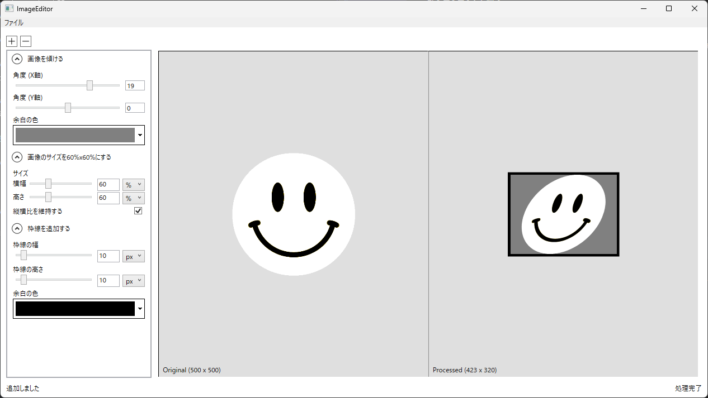

# ImageMagickGUI

長期インターンの選考課題として作成したImageMagick(Magick.NET)をGUIで使えるようにするアプリケーション



## 動作環境

- .NET 8.0
- Visual Studio 2022 以降、または他の .NET 8 対応 IDE

## インストール / ビルド手順

1. **リポジトリのクローン**  
   ```shell
   git clone https://github.com/aieuo/ImageMagickGUI
   ```

2. **プロジェクトを開く**  
   Visual StudioなどのIDEで`ImageEditor.csproj`を開く
3. **NuGetパッケージを復元**  

4. **プロジェクトをビルド**  
   ビルドに成功すると，`ImageEditor\ImageEditor\bin\Release\net8.0-windows\ImageEditor.exe`に実行ファイルが生成されます。

5. **アプリケーションを起動**  
   実行ファイルをダブルクリック、または Visual Studio から起動します。

## 使い方

1. **画像の読み込み**
    - メインウィンドウに画像をドラッグ&ドロップ
    - または`ファイル` > `画像を読み込む`ボタンをクリックし，画像ファイルを選択

2. **アクションの追加**
    - 画面左のサイドパネル上の`+`ボタンを押し，アクションを選択
    - 必要に応じてパラメータを設定

3. **プレビューの確認**
    - 編集内容はプレビューエリアにリアルタイムで反映
    - `ctrl + スクロール`で画像の拡大/縮小が可能

4. **保存**
    - `ファイル` > `画像を上書き保存する`で画像を保存，`ファイル` > `操作を上書き保存する`で編集履歴を保存
    - または`ctrl + s`で画像と編集履歴の両方を保存

## プロジェクト構成

    ImageMagickGUI/
    ├── Models/                   // Action（加工アクション）や Parameters を定義
    │   ├── Actions/
    │   ├── Parameters/
    │   ├── Deserializer/
    │   └── Serializer/
    ├── Utils/                    
    ├── ViewModels/               
    │   ├── MainWindowViewModel.cs
    │   └── DragDrop/            
    ├── Views/                    // WPF の画面定義 (XAML)
    │   ├── MainWindow.xaml
    │   ├── Converters/
    │   └── Components/           // ImagePanelなどの部品
    ├── App.xaml                  
    ├── App.xaml.cs
    ├── ImageEditor.csproj        
    ├── README.md                 
    └── ...

- **Models**: 画像処理に関するモデル，加工アクションやパラメータの定義
- **Views**: XAMLで定義された画面レイアウトやコントロール
- **ViewModels**: MVVMのViewModelレイヤー
- **Utils**: 小規模の汎用クラス群

### クレジット

<a href="https://www.flaticon.com/free-icons/resize" title="resize icons">Resize icons created by Freepik - Flaticon</a>  
<a href="https://www.flaticon.com/free-icons/rotate" title="rotate icons">Rotate icons created by Freepik - Flaticon</a>    
<a href="https://www.flaticon.com/free-icons/flip" title="flip icons">Flip icons created by Freepik - Flaticon</a>  
<a href="https://www.flaticon.com/free-icons/trim" title="trim icons">Trim icons created by ibobicon - Flaticon</a>  
<a href="https://www.flaticon.com/free-icons/photo-editing" title="photo editing icons">Photo editing icons created by Freepik - Flaticon</a>  
<a href="https://www.flaticon.com/free-icons/crop" title="crop icons">Crop icons created by Revicon - Flaticon</a>  
<a href="https://www.flaticon.com/free-icons/extent" title="extent icons">Extent icons created by Three musketeers - Flaticon</a>  
<a href="https://www.flaticon.com/free-icons/crop" title="crop icons">Crop icons created by Ilham Fitrotul Hayat - Flaticon</a>  
<a href="https://www.flaticon.com/free-icons/color" title="color icons">Color icons created by Freepik - Flaticon</a>  
<a href="https://www.flaticon.com/free-icons/rectangle" title="rectangle icons">Rectangle icons created by Freepik - Flaticon</a>  
<a href="https://www.flaticon.com/free-icons/oval" title="oval icons">Oval icons created by Freepik - Flaticon</a>  
<a href="https://www.flaticon.com/free-icons/font" title="font icons">Font icons created by Smashicons - Flaticon</a>  
<a href="https://www.flaticon.com/free-icons/shift-image" title="shift image icons">Shift image icons created by iconsmind - Flaticon</a>  

